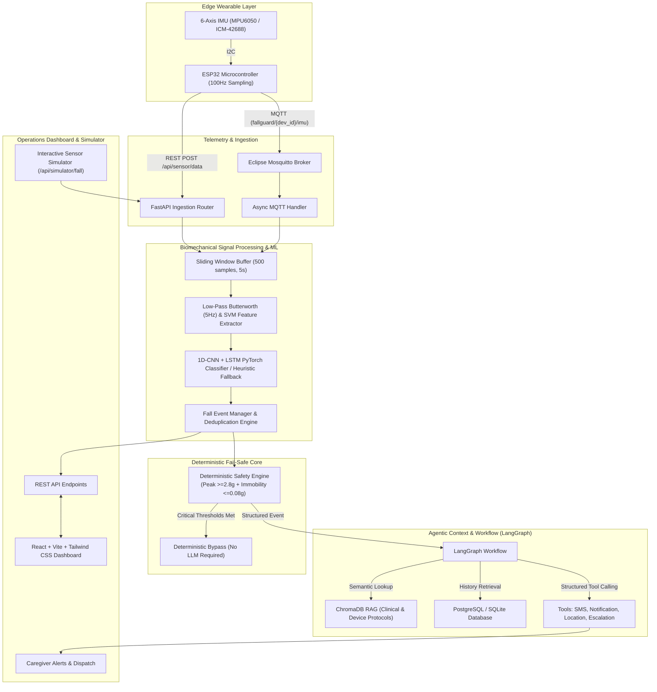

# FallGuard AI: Privacy-Preserving Wearable Fall Detection & Agentic Orchestration Platform

> [!IMPORTANT]
> **Research & Prototype Notice**: FallGuard AI is an experimental prototype system for research and engineering evaluation. It is **NOT** a certified medical device and has not been cleared or approved by the FDA or international regulatory bodies. It should never replace professional emergency medical systems or caregiver supervision.

---

## 1. System Architecture

FallGuard AI implements a multi-tier, safety-first architecture separating biomechanical signal processing from agentic contextual decision making:



---

## 2. Hardware Architecture

- **Microcontroller**: ESP32 DevKit V1 (Tensilica Xtensa Dual-Core 32-bit LX6 @ 240MHz).
- **Inertial Measurement Unit (IMU)**: InvenSense MPU6050 or TDK InvenSense ICM-42688 6-DOF (3-axis Accelerometer $\pm16g$, 3-axis Gyroscope $\pm2000^\circ/s$).
- **Bus Interface**: I2C (SDA = GPIO 21, SCL = GPIO 22, 400kHz Fast Mode).
- **Sampling Rate**: 100 Hz (10 ms discrete intervals).
- **Power**: 3.7V 500mAh LiPo battery with MCP73831 charging controller and ADC voltage divider (GPIO 34).

---

## 3. Sensor Data Ingestion Format

Wearable sensor packets are streamed via MQTT (`fallguard/{device_id}/imu`) or HTTP (`POST /api/sensor/data`):

```json
{
  "device_id": "DEV001",
  "user_id": "USER001",
  "timestamp": "2026-09-17T10:30:25Z",
  "accelerometer": {
    "x": 0.12,
    "y": 0.42,
    "z": 9.71
  },
  "gyroscope": {
    "x": 0.12,
    "y": 0.03,
    "z": 0.41
  }
}
```

---

## 4. Signal Processing & Feature Extraction

Raw accelerometer and gyroscope streams pass through:
1. **Low-Pass Filter**: 2nd-order Butterworth zero-phase filter with a 5.0 Hz cutoff to eliminate high-frequency motor tremors and sensor jitter.
2. **Signal Vector Magnitude (SVM)**:
   $$SVM_{acc} = \sqrt{a_x^2 + a_y^2 + a_z^2}$$
   $$SVM_{gyro} = \sqrt{\omega_x^2 + \omega_y^2 + \omega_z^2}$$
3. **Jerk Calculation**: Time derivative $\frac{d SVM_{acc}}{dt}$.
4. **Post-Impact Immobility**: Standard deviation of acceleration SVM following peak impact ($\le 0.08g$ indicates prolonged immobility/unconsciousness).

---

## 5. Machine Learning Architecture

Initial Model: **1D-CNN + LSTM**
- Input Shape: `(batch_size, time_steps=500, channels=6)`
- Conv1D Block 1: 32 filters, kernel size 5, BatchNorm, ReLU, MaxPool1D (stride 2)
- Conv1D Block 2: 64 filters, kernel size 5, BatchNorm, ReLU, MaxPool1D (stride 2)
- Temporal LSTM: Hidden size 64, dropout 0.3
- Dense Classification Head: 32 hidden units, Sigmoid activation $\rightarrow$ fall probability $\in [0.0, 1.0]$.

### Model Training & Evaluation

Train model with synthetic or real IMU dataset:
```bash
python ml/training/train.py --epochs 15 --batch_size 32
```

Evaluate performance metrics (Sensitivity, Specificity, ROC-AUC, Latency):
```bash
python ml/training/evaluate.py --threshold 0.5
```

---

## 6. Safety-Critical Deterministic Fail-Safe Engine

The deterministic safety engine operates **independently** of the LLM:
```python
IF fall_probability >= 0.85 AND impact_detected == True AND post_impact_motion <= 0.08:
    TRIGGER "CRITICAL" -> ESCALATE_IMMEDIATELY
```
Even if the LLM provider times out, internet drops, or database experiences latency, deterministic safety rules enforce wearer protection.

---

## 7. LangGraph Agentic Workflow

The clinical workflow agent follows a deterministic graph:
1. `receive_fall_event`: Ingest structured telemetry.
2. `validate_event`: Sanity check probability and ranges.
3. `safety_risk_assessment`: Deterministic risk evaluation.
4. `retrieve_user_history`: Query past 30 days fall incidents.
5. `retrieve_relevant_protocol`: RAG query over ChromaDB.
6. `check_device_status`: Check wearable battery and connectivity.
7. `determine_required_action`: Select `MONITOR`, `ASK_CONFIRMATION`, `ESCALATE_CAREGIVER`, or `EMERGENCY_DISPATCH`.
8. `SafetyPolicyGuard`: Overrides any LLM attempt to downgrade critical incidents.
9. Structured Tool Calling: Sends SMS alerts, triggers wearer confirmation, or cancels alarm if safely confirmed.
10. `log_event`: Structured audit logging without chain-of-thought tokens.

---

## 8. Installation & Quickstart

### Prerequisites
- Python 3.11+
- Node.js 20+
- Docker & Docker Compose

### 1. Run via Docker Compose
```bash
docker compose up --build
```
This boots:
- PostgreSQL (`5432`)
- Mosquitto MQTT (`1883`)
- ChromaDB (`8001`)
- FastAPI Backend (`8000`)
- React Vite Dashboard (`3000`)

### 2. Run Locally (Zero Setup with SQLite)

**Backend**:
```bash
python -m venv .venv
# On Windows:
.\.venv\Scripts\pip install -r backend\requirements.txt
.\.venv\Scripts\python -m uvicorn app.main:app --host 0.0.0.0 --port 8000 --reload
```

**Frontend**:
```bash
cd frontend
npm install
npm run dev
```

---

## 9. Running Tests

Run the full automated test suite:
```bash
.\.venv\Scripts\pytest -v
```

Tests cover:
- Sensor validation & bounds checking (`test_sensor.py`)
- Biomechanical signal processing & PyTorch inference (`test_fall_detection.py`)
- Deterministic safety engine fail-safe rules (`test_emergency.py`)
- Duplicate event suppression (`test_event_manager.py`)
- LangGraph state graph and structured tools (`test_agent.py`)
- ChromaDB protocol retrieval (`test_rag.py`)
- FastAPI endpoints & simulator (`test_api.py`)
- End-to-end simulation pipeline (`test_e2e_integration.py`)

---

## 10. API Specification

| Method | Endpoint | Description |
|--------|----------|-------------|
| `GET`  | `/health` | System and ML operational status |
| `POST` | `/api/sensor/data` | Ingest single 6-axis IMU packet |
| `POST` | `/api/fall/event` | Create fall event |
| `GET`  | `/api/falls/{user_id}` | Retrieve fall history |
| `GET`  | `/api/falls/{user_id}/latest` | Most recent fall incident |
| `POST` | `/api/agent/analyze` | Invoke LangGraph reasoning |
| `POST` | `/api/agent/confirm` | Wearer confirmation ("OKAY" / "TIMEOUT") |
| `POST` | `/api/simulator/fall` | Inject synthetic fall sequence |
| `POST` | `/api/simulator/normal` | Inject synthetic normal ADL |

---

## 11. Limitations & Future Clinical Work
1. **Laboratory vs. Field Dynamics**: Real-world falls exhibit complex rotational dynamics, clothing movement, and posture shifts that differ from simulated falls.
2. **Clinical Validation**: Requires IRB-approved observational trials with high-risk geriatric cohorts before clinical deployment.
3. **Battery Optimization**: 100Hz streaming requires on-device edge ML inference (e.g. TinyML / TensorFlow Lite Micro on ESP32) to conserve power.
